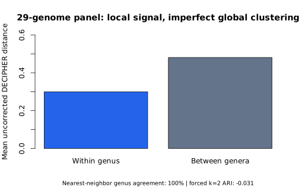

# viral-genome-comparator-r

[](https://github.com/Gaith2000korchid/viral-genome-comparator-r/actions/workflows/R-CMD-check.yaml)
[](https://github.com/Gaith2000korchid/viral-genome-comparator-r/actions/workflows/v0.3-analysis.yaml)

Reproducible comparative viral genomics in R: genome QC, whole-genome alignment, pairwise identity/coverage, distance analysis, conservation, clustering and exploratory phylogenetic interpretation of bacteriophage genomes.

[Présentation française](docs/PRESENTATION_FR.md) · [Frozen environment](docs/reproduction.md)

## Scientific question

**Can whole-genome sequence similarity recover biologically meaningful structure among related bacteriophages, and where does simple clustering fail?**

The project deliberately separates three quantities that are often conflated:

- nucleotide identity;
- alignment coverage;
- whole-genome distance.

That distinction makes it possible to detect cases where sequences are highly identical only over a restricted shared region.

## v0.3 at a glance

The current analysis uses **29 complete RefSeq bacteriophage genomes** frozen in a dated manifest:

- **12 Teseptimavirus**
- **17 Teetrevirus**

The v0.3 workflow:

1. downloads the exact accession versions from NCBI;
2. validates genome length and sequence quality;
3. aligns the complete genomes with **MAFFT**;
4. computes pairwise identity, coverage and uncorrected distance;
5. compares within-genus and between-genus distances;
6. quantifies taxonomic concordance with nearest-neighbor accuracy, Adjusted Rand Index and a permutation test;
7. summarizes site-level conservation and Shannon entropy;
8. builds an exploratory Neighbor-Joining tree;
9. diagnoses why a forced two-cluster solution can disagree with genus labels.

All analysis outputs are generated automatically by GitHub Actions.

## Main biological result

The genome-distance signal is strongly structured by genus, but the structure is **not equivalent to a clean two-cluster partition**.

| Metric | v0.3 result |
|---|---:|
| Genomes | 29 |
| Mean within-genus distance | 0.2995 |
| Mean between-genus distance | 0.4810 |
| Between − within | 0.1815 |
| Nearest-neighbor genus accuracy | **100%** |
| Permutation p-value | **0.001** |
| ARI after forcing k = 2 | **-0.031** |

The low ARI is not treated as an error to hide. A forced `k = 2` hierarchical cut produces:

- one cluster of **26 genomes**;
- one cluster of **3 highly divergent Teetrevirus**:
  - `NC_071009.1` — Salmonella phage vB_SAg-RPN15
  - `NC_029102.1` — Enterobacter phage E-2
  - `NC_028795.1` — Enterobacter phage E-3

This means that **local genomic neighborhood agrees very strongly with genus labels, while the global geometry of the distance matrix contains additional substructure**. In other words, taxonomy-related signal does not imply that a naive two-cluster cut will reproduce the taxonomy exactly.



This plot summarizes the recorded panel; it is not an external classification benchmark.

## Conservation result

The two genera also differ in sequence conservation across the alignment.

| Panel | High-occupancy sites | Conserved sites | Variable sites | Mean entropy |
|---|---:|---:|---:|---:|
| All 29 genomes | 33,400 | 11,518 | 21,882 | 0.588 |
| Teetrevirus | 31,593 | 11,437 | 20,156 | 0.491 |
| Teseptimavirus | 33,919 | **23,476** | 10,443 | **0.230** |

Within this dataset, **Teseptimavirus is substantially more conserved**, whereas the Teetrevirus panel contains much greater nucleotide diversity.

## Why the project is useful

This is not a taxonomy classifier and not a replacement for VIRIDIC, Vclust, Nextclade or established phylogenetic pipelines.

The project is an auditable case study showing how to:

- freeze biological input data by accession version;
- distinguish educational algorithms from production-scale tools;
- move from a six-genome pilot to a larger reproducible panel;
- use MAFFT for scalable whole-genome alignment;
- separate identity, coverage and distance;
- test biological structure quantitatively rather than judging a heatmap by eye;
- report a result that contradicts a simple expectation instead of tuning the method until the plot looks convenient;
- combine R package tests, R CMD check and end-to-end analysis workflows in CI.

## Repository structure

```text
R/                     reusable tested functions
tests/testthat/        unit tests
analysis/              reproducible analysis scripts
inst/extdata/          frozen manifests and provenance
results/               small versioned result snapshots
.github/workflows/     package CI and end-to-end analysis CI
docs/                  interpretation and methodological notes
```

## Reproduce v0.3

The easiest route is the GitHub Actions workflow:

`v0.3 biological interpretation`

For a frozen Linux execution (including Ubuntu under WSL2), install micromamba and run from the repository root:

```bash
micromamba create -y -n viral-genome-comparator -f environment-linux-64.explicit.txt
micromamba run -n viral-genome-comparator R CMD INSTALL .
micromamba run -n viral-genome-comparator Rscript analysis/run_v03.R
```

`environment.yml` specifies the direct versions; the explicit Linux lock fixes resolved package builds and URLs. It is not a macOS/Windows-native lock. To run the individual scripts in an R session inside that environment, load the installed package first:

```r
library(viralGenomeComparator)
source("analysis/08_download_v03_panel.R")
source("analysis/09_v03_genome_qc.R")
source("analysis/10_v03_align_distance.R")
source("analysis/11_v03_taxonomy_concordance.R")
source("analysis/12_v03_conservation.R")
source("analysis/13_v03_neighbor_joining.R")
source("analysis/14_v03_cluster_diagnostics.R")
```

Key outputs include:

- `results/v0.3_genome_qc.csv`
- `results/v0.3_pairwise_alignment_metrics.csv`
- `results/v0.3_p_distance_matrix.csv`
- `results/v0.3_taxonomy_concordance.csv`
- `results/v0.3_conservation_summary.csv`
- `results/v0.3_neighbor_joining_tree.nwk`
- `results/v0.3_cluster_assignments_k2.csv`

## Version history

### v0.1 — sequence fundamentals
DNA validation, reverse complement, basic QC, transparent Needleman-Wunsch implementation, unit tests and CI.

### v0.2 — six-genome pilot
Validated pilot panel, complete-genome alignment, identity/coverage metrics, p-distance, heatmap and clustering.

### v0.3 — biological interpretation
29-genome panel, MAFFT alignment, taxonomic concordance statistics, permutation testing, conservation/entropy, Neighbor-Joining and explicit cluster diagnostics.

## Methodological boundaries

The Neighbor-Joining tree is an exploratory distance tree, **not** a maximum-likelihood phylogeny. The two-genus panel is a focused case study, not a general benchmark of viral taxonomy. Alignment-derived distance is not equivalent to ANI or to VIRIDIC intergenomic similarity.

See [docs/methodological_notes.md](docs/methodological_notes.md) for the full interpretation boundary.

## License

MIT.
